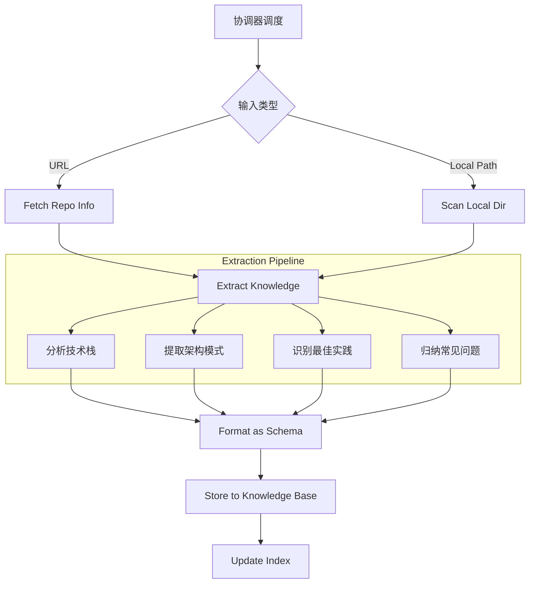

# GitHub to Skills - 仓库学习器

AI 编程系统的**学习引擎**，负责将非结构化的 GitHub 仓库代码转化为结构化的、可复用的编程知识。

## 1. 核心定位

此模块是 `evolving-agent` 架构中的**学习层**，负责将 GitHub 仓库转化为可复用知识。

- **文档位置**: `evolving-agent/modules/github-to-skills/`
- **脚本位置**: `evolving-agent/scripts/github/`
- **职责**: 自动化提取 GitHub 仓库中的"隐性知识"（架构、规范、Trick），使其变为"显性知识"。

## 2. 调度协议 (Interface)

### 输入 (Context)
由 `evolving-agent` 传递的参数：
- **GitHub URL**: 目标仓库地址
- **Focus Area**: 关注点（架构 / 最佳实践 / 全部）

### 输出 (Deliverables)
- **知识条目**: JSON 文件，存储于 `knowledge-base/{category}/`
- **索引更新**: 更新 `knowledge-base/index.json`
- **学习报告**: 向用户反馈提取了哪些关键知识

## 3. 工作流 (Workflow)



## 4. 存储策略 (Storage Strategy)

提取的知识不再创建独立的 "Skill 文件夹"，而是打散存储到统一知识库的分类中：

| 提取内容 | 目标分类 (`knowledge-base/`) | 示例 |
|---------|-----------------------------|------|
| 框架配置、依赖版本 | `tech-stacks/` | React 18 + Vite 配置模板 |
| 目录结构、分层设计 | `patterns/` | Feature-Based 架构模式 |
| 代码规范、命名约定 | `skills/` | TypeScript 严格类型最佳实践 |
| 常见报错修复 | `problems/` | Hydration Error 解决方案 |

## 5. 执行脚本 (Scripts)

所有脚本均通过 `run.py` 统一入口执行。

> **统一命令格式**:
> ```bash
> python scripts/run.py github <action> [options]
> ```

### 5.1 获取信息
```bash
python scripts/run.py github fetch <github_url>
```
输出：仓库元数据、文件树、README、关键配置文件内容。

### 5.2 提取知识
```bash
python scripts/run.py github extract --input <repo_info.json>
```
输出：符合 Schema 的结构化知识对象列表。

### 5.3 存储知识
```bash
python scripts/run.py github store --input <extracted.json>
```
操作：将知识写入知识库并更新索引。

## 6. 集成场景 (Integration)

### 场景 1：主动学习 (Active Learning)
用户发现优秀的开源项目，希望 Agent 学习其写法。
- **用户**: "学习这个仓库 https://github.com/shadcn/ui"
- **Agent**: 
  1. 调用 `python scripts/run.py github fetch <url>`
  2. 提取组件设计模式 -> `patterns/shadcn-component.json`
  3. 提取 Tailwind 配置 -> `tech-stacks/tailwind-config.json`
  4. 存入知识库

### 场景 2：知识复用 (Knowledge Reuse)
后续编程任务中，`programming-assistant` 自动复用学到的知识。
- **用户**: "用 shadcn/ui 风格写一个卡片组件"
- **Agent**:
  1. 检索关键词 "shadcn", "ui"
  2. 命中 `patterns/shadcn-component.json`
  3. 加载到上下文
  4. 生成符合 shadcn 规范的代码

## 7. 后置处理 - 进化检查 (Evolution Check)

**重要**: 仓库学习完成后，必须执行进化检查流程。

### 执行时机
- 仓库分析和知识存储完成后
- 索引更新完成后
- 向用户反馈结果前

### 检查流程

```
┌─────────────────────────────────────────────────────────────────┐
│                    进化检查入口                                  │
└───────────────────────┬─────────────────────────────────────────┘
                        │
                        ▼
┌─────────────────────────────────────────────────────────────────┐
│  Step 1: 检查进化模式状态                                        │
│  检查 .opencode/.evolution_mode_active 是否存在                  │
└───────────────────────┬─────────────────────────────────────────┘
                        │
            ┌───────────┴───────────┐
            │                       │
            ▼                       ▼
    ┌───────────────┐       ┌───────────────┐
    │ 进化模式激活   │       │ 进化模式未激活 │
    └───────┬───────┘       └───────┬───────┘
            │                       │
            ▼                       ▼
    ┌───────────────────────────────────────────────────────┐
    │  Step 2: 验证知识存储结果                              │
    │  □ 确认知识已正确存储到 knowledge-base 各分类          │
    │  □ 确认 index.json 已更新                             │
    │  □ 统计提取的知识条目数量                             │
    └───────────────────────┬───────────────────────────────┘
                            │
                            ▼
    ┌───────────────────────────────────────────────────────┐
    │  Step 3: 分析学习过程中的额外经验                      │
    │  □ 是否发现了新的分析技巧?                            │
    │  □ 是否遇到了特殊的仓库结构?                          │
    │  □ 是否有值得记录的处理方法?                          │
    └───────────────────────┬───────────────────────────────┘
                            │
            ┌───────────────┴───────────────┐
            │                               │
            ▼                               ▼
    ┌───────────────┐               ┌───────────────┐
    │ 有额外经验     │               │ 无额外经验    │
    │ → 触发归纳    │               │ → 生成报告    │
    └───────┬───────┘               └───────┬───────┘
            │                               │
            ▼                               │
    ┌───────────────────────────────┐       │
    │  运行 knowledge summarize     │       │
    │  存储学习过程经验             │       │
    └───────────────┬───────────────┘       │
                    │                       │
                    └───────────┬───────────┘
                                │
                                ▼
    ┌───────────────────────────────────────────────────────┐
    │  Step 4: 生成学习报告                                  │
    │  □ 汇总提取的知识类型和数量                           │
    │  □ 列出关键知识条目名称                               │
    │  □ 反馈给用户，告知知识可供后续使用                   │
    └───────────────────────────────────────────────────────┘
```

### 执行命令

```bash
# Step 1: 检查进化模式状态
python scripts/run.py mode --status

# Step 3: 如有额外经验，触发归纳
echo "{学习过程摘要}" | python scripts/run.py knowledge summarize \
  --auto-store --session-id "github-learning-{repo_name}"
```

### 示例场景

```
用户: 学习仓库 https://github.com/Koatty/koatty

执行流程:
1. [前置] 检查进化模式 → 已激活
2. [主任务] 加载 github-to-skills
3. [主任务] python scripts/run.py github fetch <url> → 获取仓库信息
4. [主任务] python scripts/run.py github extract → 提取知识
   - tech-stacks/koatty-ioc.json (IoC 容器模式)
   - patterns/koatty-decorator.json (装饰器模式)
   - problems/koatty-middleware.json (中间件配置)
5. [主任务] python scripts/run.py github store → 存储知识
6. [后置] 检查 .evolution_mode_active → 存在
7. [后置] 验证存储结果 → 3 条知识已存储
8. [后置] 分析额外经验 → 发现 "TypeScript 装饰器 IoC 模式"
9. [后置] 触发 knowledge summarize → 存储额外经验
10. [后置] 生成报告 → 反馈用户
```

## 8. 约束 (Constraints)

1. **Schema 兼容性**: 提取的所有数据必须符合 `knowledge-base/schema.json`。
2. **不存储源码**: 仅提取知识（Pattern/Snippet），不克隆完整仓库源码到知识库。
3. **原子化**: 一个仓库可能产生多个知识条目，应拆分存储而非打包成一个大文件。
4. **幂等性**: 重复学习同一个仓库应更新现有条目（基于 hash 或版本），而非重复创建。
5. **后置必执行**: 仓库学习完成后必须执行进化检查，确保知识正确存储。
