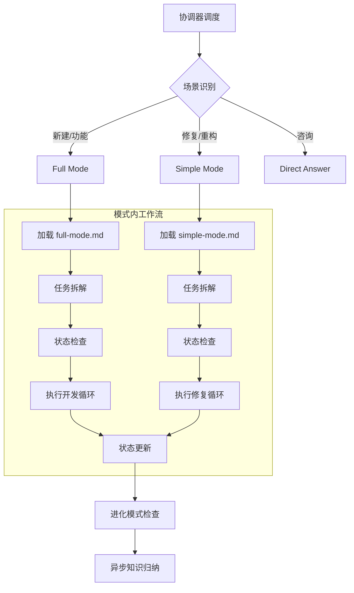

# Programming Assistant

代码生成与问题修复的执行引擎。

## 工作流 (Workflow)



## 模式选择

| 场景 | 关键词 | 模式 | 加载 |
|------|--------|------|------|
| 新建/功能 | 创建、实现、添加、开发 | Full Mode | `@load workflows/full-mode.md` |
| 修复/重构 | 修复、fix、bug、重构、优化、review | Simple Mode | `@load workflows/simple-mode.md` |
| 咨询 | 怎么、为什么、解释 | Direct Answer | 直接回答 |

## 核心流程

```
场景识别 → 加载对应模式 → 任务拆解 → 执行循环 → 状态更新 → 进化检查
```

## 状态文件

| 文件 | 用途 | 何时使用 |
|------|------|----------|
| `progress.txt` | 进度日志 | 每次状态更新 |
| `feature_list.json` | 任务清单 | Full/Simple Mode |
| `SOLUTION.md` | 架构设计 | Full Mode |
| `TASK.md` | 实现计划 | Full Mode |

## 任务拆解原则

**必须**先用 `sequential-thinking` 分析，再生成 todos 并同步到 `feature_list.json`。

每个任务：
- 非常小（< 30分钟）
- 可测试验证
- 专注单一问题
- 按依赖顺序排列

## 执行规范

1. **理解优先**: 先读代码，再修改
2. **最小改动**: 选择破坏性最小的方案
3. **验证闭环**: 每步修改必须验证
4. **状态透明**: 实时更新 progress.txt

## 进化检查（必须）

每个循环结束后执行 `@load workflows/evolution-check.md`

**进化检查逻辑**:
1. **检查标记**: 是否存在 `.opencode/.evolution_mode_active`
2. **触发归纳**:
   - 如果 **进化模式激活**: 自动归纳
   - 如果 **复杂问题解决**: 自动归纳
   - 如果 **用户明确要求**: 自动归纳

## 常用命令

```bash
python scripts/run.py project detect .      # 检测技术栈
python scripts/run.py knowledge trigger --input "..." # 检索知识
python scripts/run.py mode --status         # 进化模式状态
```
