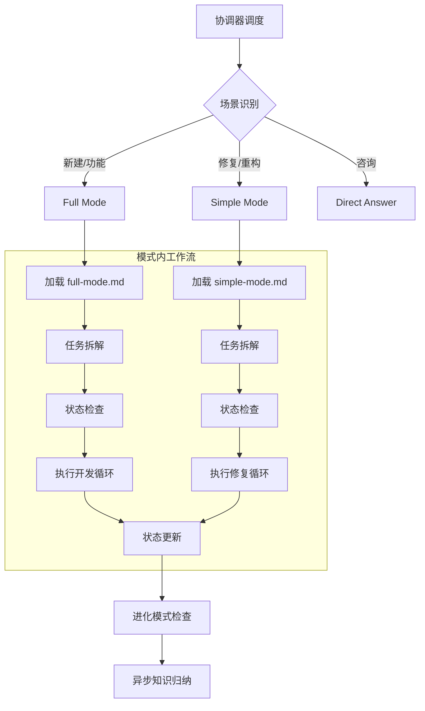

# Programming Assistant

AI 编程系统的**核心执行引擎**，负责具体编程任务的高质量交付。

## 1. 核心定位

此模块是 `evolving-agent` 架构中的**执行层**。它是 evolving-agent 的内部模块，负责具体编程任务的执行。

- **位置**: `evolving-agent/modules/programming-assistant/`
- **脚本**: `evolving-agent/scripts/programming/`
- **职责**: 专注于将需求转化为代码，保证代码质量、可维护性和架构一致性。

## 2. 调度协议 (Interface)

### 输入 (Context)
由 `evolving-agent` 传递的上下文环境：
- **任务类型**: 新建项目 / 功能开发 / 问题修复 / 代码重构 / 咨询
- **进化状态**: 是否开启进化模式 (`.opencode/.evolution_mode_active`)
- **知识上下文**: 是否存在预检索的知识 (`.knowledge-context.md`)

### 输出 (Deliverables)
- **代码变更**: 文件修改、新增文件
- **状态文件**: `progress.txt`, `feature_list.json` (用于任务追踪)
- **知识信号**: 
  - 显式信号: 用户反馈 "记住这个"
  - 隐式信号: 复杂问题解决标记 (用于触发 `trigger_detector`)

## 3. 工作流 (Workflow)



### 场景识别规则

| 用户意图 | 关键词示例 | 分发模式 |
|---------|-----------|---------|
| 新建项目 | "创建"、"新建"、"初始化" | Full Mode |
| 功能开发 | "实现"、"添加"、"开发" | Full Mode |
| 问题修复 | "修复"、"fix"、"bug"、"报错" | Simple Mode |
| 代码重构 | "重构"、"优化"、"refactor" | Simple Mode |
| 代码审查 | "review"、"检查"、"审查" | Simple Mode |
| 技术咨询 | "怎么"、"为什么"、"解释" | Direct Answer |

## 4. 场景模式 (Capabilities)

### 4.1 Full Mode (完整开发)
适用于新建项目或复杂功能开发。
- **加载**: `@load workflows/full-mode.md`
- **核心**: 必须维护 `SOLUTION.md` (架构)、`TASK.md` (计划)、`feature_list.json` (任务列表)。
- **流程**: 任务拆解 -> 状态检查 -> 迭代开发 -> 状态更新。

### 4.2 Simple Mode (快速修复)
适用于 Bug 修复、重构或代码审查。
- **加载**: `@load workflows/simple-mode.md`
- **核心**: 必须维护 `progress.txt` 和 `feature_list.json`。
- **流程**: 任务拆解(复杂修复) -> 状态检查 -> 修复循环 -> 状态更新。

### 4.3 任务拆解原则

**关键**: 拆解任务前**必须先使用 `sequential-thinking` 进行深度分析**，归纳总结后再生成 todos。

每个任务必须：
- **非常小且可测试** (< 30分钟完成)
- **有明确的开始与结束**
- **专注于一个问题**
- **按实现顺序排列**
- **同步写入 `feature_list.json`**

## 5. 知识集成 (Knowledge Integration)

本模块深度集成知识库，实现"检索-利用-归纳"闭环。

> **统一入口**: 使用 `run.py` 统一调用所有功能，自动处理路径和环境检测。

### 5.1 知识检索 (Retrieval)
任务开始时，**必须**启动异步子会话检索知识，不阻塞主线程。

```python
Task(
    subagent_type="general",
    description="Knowledge retrieval",
    prompt="""
    执行知识检索:
    python scripts/run.py knowledge trigger \
      --input "{用户输入}" \
      --project "." \
      --format context > .knowledge-context.md
    """
)
```

**使用方式**:
- 在制定计划阶段，读取 `.knowledge-context.md`。
- 参考其中的"最佳实践"和"历史解决方案"。

### 5.2 知识归纳 (Summarization)
任务结束前，**必须**进行进化检查。如果满足条件，启动异步归纳。

**进化检查逻辑**:
1. **检查标记**: 是否存在 `.opencode/.evolution_mode_active`
2. **触发归纳**:
   - 如果 **进化模式激活**: 自动归纳
   - 如果 **复杂问题解决**: 自动归纳
   - 如果 **用户明确要求**: 自动归纳

```python
Task(
    subagent_type="general",
    description="Knowledge summarization", 
    prompt="""
    分析会话并归纳知识:
    echo "{session_summary}" | python scripts/run.py knowledge summarize \
      --auto-store --session-id "{session_id}"
    """
)
```

## 6. 执行规范 (Best Practices)

1. **理解优先**: 永远不要盲目修改。先阅读代码，理解上下文，再制定计划。
2. **最小改动**: 优先选择破坏性最小的方案。
3. **验证闭环**: 每一步修改都必须伴随验证（测试、编译或运行）。
4. **状态透明**: 实时更新 `progress.txt`，让用户随时知道进度。
5. **异步思维**: 耗时的知识操作（检索/归纳）必须异步执行，保证交互流畅性。

## 7. 常用命令

```bash
# 查看项目知识
python scripts/run.py project query --project .

# 手动存储经验 (开发过程中发现重要模式时)
python scripts/run.py project store --tech {tech} --pattern "{pattern}"

# 进化模式状态
python scripts/run.py mode --status

# 检测项目技术栈
python scripts/run.py project detect .

# 查看知识库统计
python scripts/run.py knowledge query --stats
```
