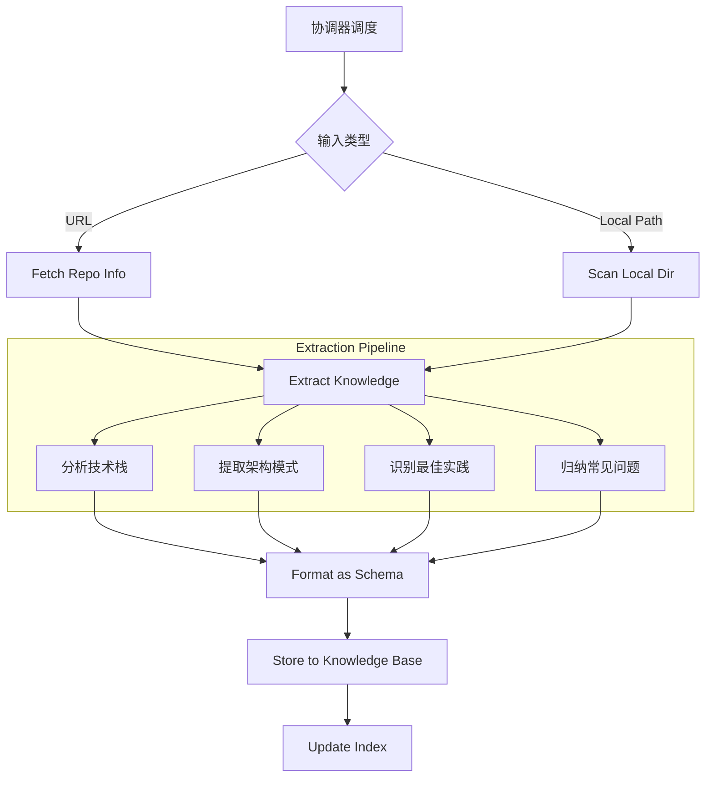

# GitHub to Skills - 仓库学习器

AI 编程系统的**学习引擎**，负责将非结构化的 GitHub 仓库代码转化为结构化的、可复用的编程知识。

## 1. 核心定位

此 Skill 是 `evolving-agent` 架构中的**学习层**。它不直接执行编程任务，而是为 `knowledge-base` 输送高质量的外部知识。

- **上游**: `evolving-agent` (负责意图识别和调度)
- **下游**: `knowledge-base` (存储提取的知识条目)
- **职责**: 自动化提取 GitHub 仓库中的"隐性知识"（架构、规范、Trick），使其变为"显性知识"。

## 2. 调度协议 (Interface)

### 输入 (Context)
由 `evolving-agent` 传递的参数：
- **GitHub URL**: 目标仓库地址
- **Focus Area**: 关注点（架构 / 最佳实践 / 全部）

### 输出 (Deliverables)
- **知识条目**: JSON 文件，存储于 `knowledge-base/{category}/`
- **索引更新**: 更新 `knowledge-base/index.json`
- **学习报告**: 向用户反馈提取了哪些关键知识

## 3. 工作流 (Workflow)



## 4. 存储策略 (Storage Strategy)

提取的知识不再创建独立的 "Skill 文件夹"，而是打散存储到统一知识库的分类中：

| 提取内容 | 目标分类 (`knowledge-base/`) | 示例 |
|---------|-----------------------------|------|
| 框架配置、依赖版本 | `tech-stacks/` | React 18 + Vite 配置模板 |
| 目录结构、分层设计 | `patterns/` | Feature-Based 架构模式 |
| 代码规范、命名约定 | `skills/` | TypeScript 严格类型最佳实践 |
| 常见报错修复 | `problems/` | Hydration Error 解决方案 |

## 5. 执行脚本 (Scripts)

所有脚本均位于 `github-to-skills/scripts/` 目录下。

### 5.1 获取信息
```bash
~/.config/opencode/skills/evolving-agent/.venv/bin/python ~/.config/opencode/skills/github-to-skills/scripts/fetch_github_info.py <github_url>
```
输出：仓库元数据、文件树、README、关键配置文件内容。

### 5.2 提取知识
```bash
~/.config/opencode/skills/evolving-agent/.venv/bin/python ~/.config/opencode/skills/github-to-skills/scripts/extract_patterns.py --input <repo_info.json>
```
输出：符合 Schema 的结构化知识对象列表。

### 5.3 存储知识
```bash
~/.config/opencode/skills/evolving-agent/.venv/bin/python ~/.config/opencode/skills/github-to-skills/scripts/store_to_knowledge.py --input <extracted.json>
```
操作：将知识写入 `knowledge-base` 并更新索引。

## 6. 集成场景 (Integration)

### 场景 1：主动学习 (Active Learning)
用户发现优秀的开源项目，希望 Agent 学习其写法。
- **用户**: "学习这个仓库 https://github.com/shadcn/ui"
- **Agent**: 
  1. 调用 `fetch_github_info.py`
  2. 提取组件设计模式 -> `patterns/shadcn-component.json`
  3. 提取 Tailwind 配置 -> `tech-stacks/tailwind-config.json`
  4. 存入知识库

### 场景 2：知识复用 (Knowledge Reuse)
后续编程任务中，`programming-assistant` 自动复用学到的知识。
- **用户**: "用 shadcn/ui 风格写一个卡片组件"
- **Agent**:
  1. 检索关键词 "shadcn", "ui"
  2. 命中 `patterns/shadcn-component.json`
  3. 加载到上下文
  4. 生成符合 shadcn 规范的代码

## 7. 约束 (Constraints)

1. **Schema 兼容性**: 提取的所有数据必须符合 `knowledge-base/schema.json`。
2. **不存储源码**: 仅提取知识（Pattern/Snippet），不克隆完整仓库源码到知识库。
3. **原子化**: 一个仓库可能产生多个知识条目，应拆分存储而非打包成一个大文件。
4. **幂等性**: 重复学习同一个仓库应更新现有条目（基于 hash 或版本），而非重复创建。
